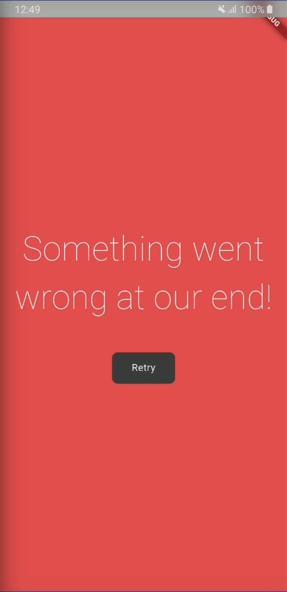

# Weather App

Flutter SDK: 3.29.1

## Giới thiệu
Ứng dụng thời tiết là một ứng dụng Flutter hiện đại giúp người dùng theo dõi thông tin thời tiết. Ứng dụng hỗ trợ đa ngôn ngữ (Tiếng Anh, Tiếng Việt) và được tổ chức theo kiến trúc Clean Architecture với BLoC pattern.



## Cấu trúc dự án

### Cấu trúc thư mục chính
```
lib/
├── app/                  # Cấu hình ứng dụng
│   ├── config/           # Các lớp cấu hình (ngôn ngữ, theme...)
│   └── di/               # Dependency Injection container
├── core/                 # Các thành phần cốt lõi
│   ├── assets/           # Tài nguyên ứng dụng (colors, images...)
│   ├── errors/           # Xử lý lỗi và exceptions
│   ├── network/          # Cấu hình mạng
│   ├── utils/            # Tiện ích (helpers, extensions...)
│   └── widgets/          # Widget dùng chung
├── features/             # Các tính năng của ứng dụng (theo module)
│   ├── weather/          # Module thời tiết
│   └── demo/             # Module demo
├── i18n/                 # Đa ngôn ngữ (arb files)
├── repositories/         # Repository layer (business logic)
├── services/             # Service layer (data providers)
└── src/                  # Mã nguồn phụ trợ
    ├── models/           # Các model dữ liệu
    └── generated/        # Code được sinh tự động
```

```
test/
├── core/                 # Kiểm thử cho các thành phần cốt lõi
│   └── errors/           # Kiểm thử cho exceptions
├── features/             # Kiểm thử cho các tính năng
│   └── weather/          # Kiểm thử cho module thời tiết
│       ├── bloc/         # Kiểm thử cho bloc
│       └── widgets/      # Kiểm thử cho widgets
├── repositories/         # Kiểm thử cho repositories
└── services/             # Kiểm thử cho services
```

### Gói thư viện chính
- **flutter_bloc**: Quản lý trạng thái ứng dụng theo BLoC pattern
- **go_router**: Điều hướng và xử lý deeplink
- **get_it**: Dependency Injection
- **shared_preferences**: Lưu trữ cục bộ
- **http**: Gọi API HTTP
- **intl & flutter_localizations**: Hỗ trợ đa ngôn ngữ 
- **equatable**: So sánh đối tượng
- **flutter_dotenv**: Quản lý biến môi trường
- **geolocator**: Truy cập vị trí người dùng
- **mocktail**: Thư viện mock cho testing
- **bloc_test**: Hỗ trợ kiểm thử BLoC

## Kiến trúc
Ứng dụng được xây dựng theo kiến trúc Clean Architecture với các lớp rõ ràng:

### 1. Presentation Layer (UI)
- **features/**: Chứa các module UI được tổ chức theo tính năng
- **widgets/**: Các UI component tái sử dụng
- **bloc/**: Quản lý trạng thái UI và business logic

### 2. Domain Layer
- **repositories/**: Chứa business logic và điều phối dữ liệu
- **models/**: Định nghĩa các entity và data models

### 3. Data Layer
- **services/**: Cung cấp dữ liệu từ các nguồn khác nhau (API, local storage)
- **dto/**: Đối tượng chuyển đổi dữ liệu giữa layers

### 4. Infrastructure
- **app/di/**: Dependency Injection
- **core/**: Các tiện ích và cấu hình cốt lõi

## Quy tắc và Nguyên tắc

### Dependency Injection
- Sử dụng Service Locator Pattern với `get_it`
- Tất cả dependencies được đăng ký và khởi tạo tại `app/di/injection_container.dart`
- UI layer không được khởi tạo services trực tiếp mà phải lấy từ DI container

### Separation of Concerns
- Mỗi lớp chỉ có một trách nhiệm duy nhất (Single Responsibility)
- Tách biệt interface và implementation
- Repository không được gọi API trực tiếp mà phải thông qua services

### UI và State Management
- Sử dụng BLoC pattern cho state management
- Tách UI thành các widget nhỏ, tái sử dụng
- Tránh khởi tạo dependencies trong phương thức `build` của widget

### Xử lý lỗi
- Sử dụng custom exceptions để phân loại lỗi
- Xử lý lỗi ở tầng repository trước khi đưa lên UI
- Hiển thị thông báo lỗi thân thiện với người dùng

## Kiểm thử (Testing)

### Cấu trúc kiểm thử
- Cấu trúc thư mục test phản ánh cấu trúc thư mục lib
- Mỗi thành phần của ứng dụng đều có bài kiểm thử tương ứng
- Sử dụng pattern AAA (Arrange-Act-Assert) để tổ chức các test case

### Các loại kiểm thử
1. **Unit Tests**: Kiểm thử từng thành phần riêng lẻ
   - Tests cho Services (WeatherService, LocationService)
   - Tests cho Repositories (WeatherRepository)
   - Tests cho BLoCs (WeatherBloc)
   - Tests cho Models và Exceptions

2. **Widget Tests**: Kiểm thử UI components
   - Kiểm tra hiển thị dữ liệu đúng
   - Kiểm tra xử lý các trạng thái khác nhau (nhiệt độ dương/âm)

### Công cụ kiểm thử
- **mocktail**: Mock các dependencies để cô lập unit tests
- **bloc_test**: Kiểm thử BLoC states và events
- **flutter_test**: Framework kiểm thử Flutter chính thức

### Kỹ thuật mock
- Sử dụng wrappers để mock các static methods (ví dụ: Geolocator)
- Sử dụng Mocktail để tạo mocks cho các dependencies
- Verify các cuộc gọi phương thức để đảm bảo chúng được thực hiện đúng

### Chạy tests
```bash
# Chạy tất cả tests
flutter test

# Chạy test cho một file cụ thể
flutter test test/services/weather_service_test.dart

# Chạy test với coverage
flutter test --coverage
```

## Cài đặt & Chạy
```bash
# Clone dự án
git clone <repository_url>

# Cài đặt các dependency
flutter pub get

# Chạy ứng dụng
flutter run
```

## Phát triển
Khi phát triển tính năng mới, hãy tuân thủ quy trình sau:
1. Tạo interface và implementation cho services mới
2. Đăng ký service trong DI container
3. Tạo repository để xử lý business logic
4. Tạo bloc để quản lý state của tính năng
5. Phát triển UI components sử dụng bloc
6. Viết tests cho mỗi lớp đã tạo (services, repositories, bloc, UI)

## API
Ứng dụng sử dụng OpenWeatherMap API để lấy dữ liệu thời tiết. Các API được sử dụng bao gồm:
- Current Weather API
- 5-day Forecast API
- Geo Coding API

## Môi trường
Ứng dụng sử dụng .env file để quản lý các biến môi trường như API keys. Đảm bảo tạo file `.env` trong thư mục gốc với các biến cần thiết trước khi chạy ứng dụng.